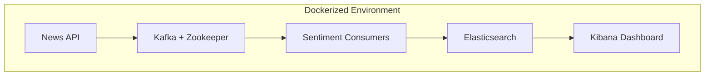

# 📰 Real-Time Trump News Sentiment Analysis  
**A Comprehensive End-to-End Data Pipeline for Political Media Insights**


> Real-time sentiment analysis pipeline that ingests live political news data, processes it through distributed streaming, performs sentiment classification, and visualizes results in real-time dashboards.

---

## 🧭 Overview

This project implements a **real-time data engineering and NLP pipeline** that continuously analyzes **Trump-related news sentiment** using modern technologies.  
It demonstrates a full end-to-end system — from **data ingestion** to **visualization** — fully containerized with **Docker** for scalability and portability.

---

## ⚙️ System Architecture



**Pipeline Stages**
1. **Data Ingestion:** Fetch Trump-related articles from the [News API](https://newsapi.org).  
2. **Streaming:** Push data into Apache Kafka for real-time processing.  
3. **Processing:**  
   - *Consumer 1:* Indexes news articles into Elasticsearch.  
   - *Consumer 2:* Performs sentiment analysis using **VADER NLP**.  
   - *Consumer 3:* Generates word frequency indices for word clouds.  
4. **Storage:** Store enriched data (sentiment, metadata) in **Elasticsearch**.  
5. **Visualization:** Interactive dashboards in **Kibana**.  
6. **Deployment:** Fully containerized using **Docker** for easy setup and scalability.

---

##  Core Features

| Feature | Description |
|:---------|:-------------|
|  **Real-Time News Ingestion** | Fetches breaking Trump-related articles via News API. |
|  **Kafka Streaming** | Streams data in real-time for scalable processing. |
|  **VADER Sentiment Analysis** | Analyzes article tone as positive, negative, or neutral. |
|  **Elasticsearch Indexing** | Stores enriched data for fast search and analytics. |
|  **Kibana Dashboards** | Visualizes trends, sentiment distribution, and word clouds. |
|  **Dockerized Deployment** | Ensures reproducibility and easy multi-container setup. |

---

## Tech Stack

| Layer | Technology |
|:------|:------------|
| **Data Source** | [News API](https://newsapi.org) |
| **Data Streaming** | Apache Kafka + Zookeeper |
| **Data Processing** | Python (Producers & Consumers) |
| **Sentiment Analysis** | VADER (NLTK) |
| **Storage & Search** | Elasticsearch |
| **Visualization** | Kibana |
| **Containerization** | Docker & Docker Compose |

---

##  Pipeline Components

### **Producer.py**
- Fetches latest Trump-related articles via News API.
- Publishes structured JSON to Kafka topic `trump_news`.

### **Consumer 1 – News Indexer**
- Reads Kafka messages.
- Indexes raw news articles into Elasticsearch.

### **Consumer 2 – Sentiment Processor**
- Applies VADER sentiment analysis.
- Enriches each article with:
  - Polarity score (positive/neutral/negative)
  - Confidence level
  - Source metadata

### **Consumer 3 – Word Indexer**
- Extracts all words from headlines.
- Removes stopwords.
- Builds a frequency index for **word cloud generation** in Kibana.

---
### Dashboard Previe

*Example: Real-time sentiment and keyword analysis in Kibana.*

---

## 💻 Installation & Setup

###  Clone Repository
```bash
git clone https://github.com/homunculus86/twitter_tarrifs_analysis
cd trump-news-sentiment-pipeline
```

###  Configure Environment
Create a `.env` file:
```
NEWS_API_KEY=your_newsapi_key
ELASTIC_HOST=http://localhost:9200
KAFKA_BROKER=localhost:9092
```

###  Start the Dockerized Pipeline

###  Access the Interfaces
| Service | URL |
|:--------|:----|
| **Kibana Dashboard** | http://localhost:5601 |
| **Elasticsearch** | http://localhost:9200 |
| **Kafka UI (optional)** | http://localhost:8080 |

---

## Example Output

**Sample Sentiment Scores (from VADER):**

| Headline | Sentiment | Score |
|:----------|:-----------|:-------|
| “Trump rallies supporters in key state” | Positive | 0.64 |
| “Critics question Trump policy decision” | Negative | -0.55 |
| “Trump discusses economy in TV interview” | Neutral | 0.05 |

---

##  Key Highlights

 Real-time **NLP sentiment classification**  
 End-to-end **data engineering pipeline**  
 Modular & **containerized architecture**  
 Interactive **Kibana dashboards**  
 Scalable and **production-ready** design  

---

##  Future Enhancements

-  Integrate **transformer-based sentiment models** (e.g., BERT, RoBERTa).  
-  Add **MongoDB or PostgreSQL** for historical archiving.  
-  Include **alerting system** for sentiment spikes.  
-  Expand to multiple political entities or keywords.  

---

## 📜 License
This project is licensed under the [MIT License](LICENSE).

---


